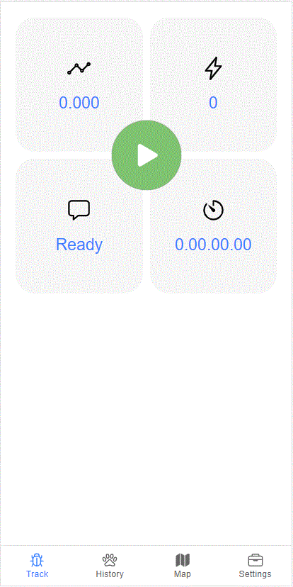

# Ion Progressive Circle Button

 Progressive Circle Button Component for Ionic.

# Required

  Ionic 4 and 5

# How to Install
```
  $ npm i ion-progressive-circle-button --save
```

# API


## Events | Events
 - `onChargeComplete: EventEmitter` - Event emitter fired when charge is complete.

## Inputs
  - `reverseAnim: boolean` - Perform inverse animation when charge is complete. Default value: `true`.
  - `useShadow: boolean` - Use shadow border style. Default value: `true`.
  - `disabled: boolean` - Disable button. Default value: `false`.
  - `startAt: number` - Define start point position. Range values: 0..360. Default value: `0`.
  - `endAt: number` - Define end point position. Range values: 0..360. Default value: `360`.
  - `reduceRadius: number` - Define how much percentage button will be reduced. Unit in %. Default value: `24`.
  - `radiusAnimation: string` - Defines the animation type when reducing the button. Default value: `ease-in-out`.
  - `radiusAnimationDuration: number` - Defines the animation time when reducing the button. Unit in seconds! Default value: `0.2`.
  - `color: any` - Button color. Default value: `black`.
  - `iconColor: any` -Icon button color. Default value: `white`.
  - `strokeColor: any` - Stroke button color. Default value: `black`.
  - `disabledColor: any` - Button's color when is not active. Default value: `lightgray`.
  - `size: number` - Button size. Unit in pixel. Default value: `100%`.
  - `strokeSize: number` -  Stroke size. Unit in percentage referred to the size of the button! Unit in %. Range values: 0..100. Default value: `16`.
  - `strokeRadius: number` - Stroke radius size. Unit in percentage referred to the size of the button! Unit in %. Range values: 0..100 Default value: `92`.
  - `strokeFillDuration: nunmber` - Stroke animation time. Unit in seconds. Default value: `3`.
  - `strokeRestoreDuration: number` - Stroke restore animation time duration. Unit in seconds. Default value: `0.3`.
  - `strokeFillAnimation: string` - Defines the animation type when stroke is charging. Default value: `ease-out`.
  - `strokeRestoreAnimation: string` - Defines the animation type when reducing stroke. Default value: `ease-out`.
  - `enableChargeAnimation: boolean` -Use charging animation. Default value: `false`.
  - `reduceIcon: true` -Reduce icon button in the same time as the main animation. Default value: `true`.
  
# Demostration



# Integration and Usage

## Integration
First, import the IonProgressiveCircleButtonModule to your app:

```typescript
import { IonProgressiveCircleButtonModule } from 'ion-progressive-circle-button';

@NgModule({
  imports: [
    ...,
    IonProgressiveCircleButtonModule
  ],
  ...
})
export class AppModule { }
```

## Usage
### Step A - Using templeate

Use it in your component template like this:

```html
<ion-content no-bounce>
    .....
<ion-content>

<ion-progressive-circle-button
    [size]="100" 
    [enableChargeAnimation]="true"
    [color]="'rgba(218,105,102,1)'" 
    [strokeColor]="'rgba(218,105,102,1)'" 
    [iconColor]="'white'"
  >
  
  !! --> your icon here <---- !!

</ion-progressive-circle-button>
```

### Step B - Define icon
As you can see icon must be defined inside templeate. You can use svg, png, jpg, ion-icon etc..

Example:

```html
<ion-progressive-circle-button 
    [size]="100" 
    [enableChargeAnimation]="true"
    [color]="'rgba(218,105,102,1)'" 
    [strokeColor]="'rgba(218,105,102,1)'" 
    [iconColor]="'white'"
>
  <svg xmlns="http://www.w3.org/2000/svg" viewBox="0 0 512 512">
    <path style="transform: translateX(12%)" d="M424.4 214.7L72.4 6.6C43.8-10.3 0 6.1 0 47.9V464c0 37.5 40.7 60.1 72.4 41.3l352-208c31.4-18.5 31.5-64.1 0-82.6z"/>
  </svg>

</ion-progressive-circle-button>
```

or

```html
<ion-progressive-circle-button 
    [size]="100" 
    [enableChargeAnimation]="true"
    [color]="'rgba(218,105,102,1)'" 
    [strokeColor]="'rgba(218,105,102,1)'" 
    [iconColor]="'white'"
>
  <ion-icon name="alarm-outline" style="font-size:25px"></ion-icon>

</ion-progressive-circle-button>
```

or

```html
<ion-progressive-circle-button 
    [size]="100" 
    [enableChargeAnimation]="true"
    [color]="'rgba(218,105,102,1)'" 
    [strokeColor]="'rgba(218,105,102,1)'" 
    [iconColor]="'white'"
>
  

</ion-progressive-circle-button>
```


# License

The MIT License (MIT)

Copyright (c) 2020 Davide Carboni

Permission is hereby granted, free of charge, to any person obtaining a copy of this software and associated documentation files (the "Software"), to deal in the Software without restriction, including without limitation the rights to use, copy, modify, merge, publish, distribute, sublicense, and/or sell copies of the Software, and to permit persons to whom the Software is furnished to do so, subject to the following conditions:

The above copyright notice and this permission notice shall be included in all copies or substantial portions of the Software.

THE SOFTWARE IS PROVIDED "AS IS", WITHOUT WARRANTY OF ANY KIND, EXPRESS OR IMPLIED, INCLUDING BUT NOT LIMITED TO THE WARRANTIES OF MERCHANTABILITY, FITNESS FOR A PARTICULAR PURPOSE AND NONINFRINGEMENT. IN NO EVENT SHALL THE AUTHORS OR COPYRIGHT HOLDERS BE LIABLE FOR ANY CLAIM, DAMAGES OR OTHER LIABILITY, WHETHER IN AN ACTION OF CONTRACT, TORT OR OTHERWISE, ARISING FROM, OUT OF OR IN CONNECTION WITH THE SOFTWARE OR THE USE OR OTHER DEALINGS IN THE SOFTWARE.